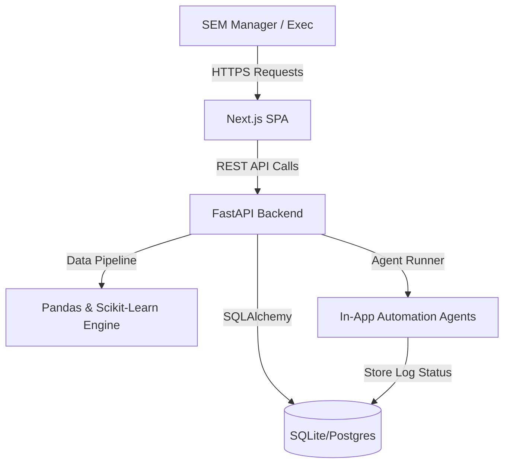
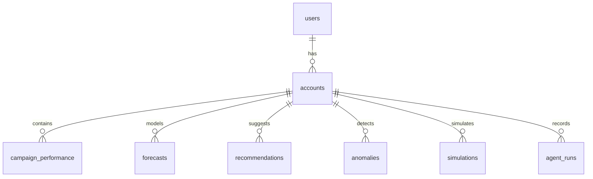

# System Architecture Document - ForecastIQ AI

## 1. High-Level Architecture
ForecastIQ AI is designed as a decoupled monorepo application consisting of:
1.  **Frontend (Next.js 15 + Tailwind CSS + Recharts)**: Single-page dashboard application reading from FastAPI.
2.  **Backend (FastAPI + SQLAlchemy + SQLite/PostgreSQL)**: REST API processing uploads, fitting models, running rule engines, and executing automation agent tasks.
3.  **Data Engines (Pandas + Scikit-Learn + NumPy)**: Underlying analytical routines executing forecasts, scenario simulations, and outlier checks.

## 2. Database Schema Relationships
The system employs the following database entities:

*   **User**: Individual system operator.
*   **Account**: Advertising network entity (Google, Meta, etc.) owned by a user.
*   **CampaignPerformance**: Historical raw campaign performance logs stored per date.
*   **Forecast**: Generated predictions for metrics per campaign per forecast horizon date.
*   **Recommendation**: Optimization items triggered by historical trends or anomalies.
*   **Anomaly**: Point-in-time outliers flagged by statistical rules.
*   **Simulation**: Saved budget simulator scenarios.
*   **AgentRun**: Auditable records of daily/weekly automation agent runs.

## 3. Core Processing Pipelines
1.  **CSV Upload Pipeline**: File uploaded -> Data Quality Agent checks for invalid entries/missing cols -> Derivative columns calculated -> Saved to `campaign_performance`.
2.  **Forecasting Pipeline**: Fetch last 90-day history -> Interpolate missing dates -> Apply multi-variable linear regression with trend and day-of-week indicators -> Generate 7, 14, 30 day outlooks -> Store values with lower/upper bands.
3.  **Agents Framework**: Agents are configured in `backend/app/services/agents.py` and execute sequentially, creating entries in `agent_runs` containing run summary and payload JSON.
